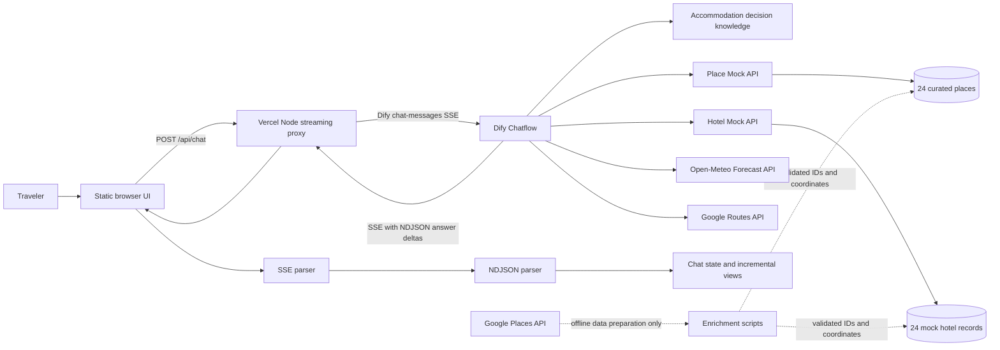
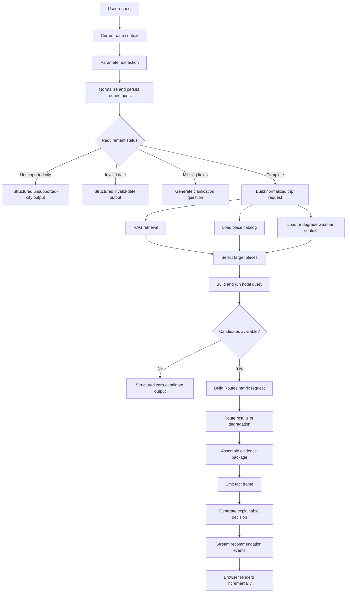

# 旅策 / TravelStay Agent

An explainable accommodation decision prototype that combines structured travel requirements, curated Haikou data, retrieval-augmented guidance, route evidence, and weather context.

TravelStay Agent was developed as a four-person course project. The current MVP focuses on accommodation decisions in Haikou, China. It is a reproducible prototype, not a booking platform, a live inventory service, or a production system for arbitrary cities.

## Problem And Motivation

Hotel lists sorted only by price or review score do not capture why a stay fits a particular trip. A traveler may care about a nightly or total budget, group size, trip dates, transport hubs, specific attractions, driving access, business needs, or a resort-oriented experience. These constraints can conflict.

TravelStay Agent turns a conversational request into structured requirements, asks for missing information when necessary, gathers controlled hotel and place facts, adds route and weather evidence, and produces recommendations with explicit trade-offs. The design separates factual data, reusable decision rules, dynamic API evidence, and final language-model reasoning.

## Implemented Scope

- Haikou-only accommodation decision workflow.
- Multi-turn clarification backed by Dify conversation variables.
- Structured extraction of city, dates, travelers, budget, trip style, and preferences.
- Retrieval over eight accommodation decision knowledge documents.
- Deterministic JSON-backed APIs for 24 hotels and 24 decision-relevant places.
- Candidate filtering and preference scoring before final LLM reasoning.
- Open-Meteo forecast retrieval with full, partial, and unavailable-data handling.
- Google Routes matrix requests with an existing degradation path when route input is unavailable.
- Evidence assembly followed by primary and alternative accommodation recommendations.
- Streaming Dify proxy, SSE parsing, NDJSON business events, incremental state reduction, and browser rendering.
- Explicit outputs for unsupported cities, invalid dates, incomplete requests, and zero candidates.

## Key Features

### Explainable decisions

The workflow does not treat one ranking score as the final answer. It combines budget fit, area and sub-area preferences, trip purpose, target places, route results, weather conditions, and RAG guidance into an evidence package for the final decision node.

### Controlled data boundary

Hotel commercial fields such as prices, room availability, breakfast, and cancellation rules are mock course-project data. Hotel and place entities contain pre-enriched Google Place IDs and coordinates, but the runtime Mock APIs never call Google Places.

### Resilient streaming UI

The browser consumes two nested protocols: Dify SSE transport and project-specific NDJSON events carried in incremental `answer` text. Chunk boundaries, UTF-8 fragmentation, malformed events, cancellation, partial rendering, and conversation IDs are covered by tests.

### Reproducible workflow source

The repository includes the exported Dify Chatflow at [`dify/travelstay-chatflow.yml`](dify/travelstay-chatflow.yml). The audited DSL is an `advanced-chat` application with 39 nodes and 44 edges.

## System Architecture



The browser never receives `DIFY_API_KEY` or `GOOGLE_MAPS_API_KEY`. Google Places is outside the runtime path; Google Routes is the runtime routing service.

## End-to-End Workflow



## Technology Stack

| Layer | Implementation |
| --- | --- |
| Agent orchestration | Dify advanced Chatflow DSL |
| LLM configuration | Google Gemini provider in Dify |
| Retrieval | Dify knowledge retrieval over repository Markdown sources |
| Server API | Vercel Node functions using CommonJS |
| Frontend | Static HTML, CSS, and framework-free JavaScript |
| Streaming | Dify SSE plus NDJSON business events |
| Runtime data | JSON-backed hotel and place APIs |
| Dynamic context | Google Routes and Open-Meteo |
| Offline enrichment | Python scripts using Google Places API (New) |
| Tests | Node built-in test runner and Python `unittest` |

## Data And API Design

### Hotel data

[`data/mock_hotels_haikou.json`](data/mock_hotels_haikou.json) contains 24 records. Stable entity fields are separated from explicitly marked mock commercial fields. The hotel endpoint supports hard constraints such as budget, area, guests, availability, parking, and cancellation, plus soft area, trip-style, traveler-type, and tag preferences.

### Place data

[`data/haikou_target_places.json`](data/haikou_target_places.json) contains 24 transport hubs, attractions, commercial areas, campuses, and resort-oriented destinations. Place records include decision value, preferred hotel areas, weather sensitivity, route priority, Place ID, and coordinates.

### Knowledge base

[`knowledge_base/`](knowledge_base/) contains eight rule-oriented Markdown documents. They describe how to reason about budgets, areas, transport, weather, trip planning, hotel selection, hotel terminology, and local food context. They intentionally avoid duplicating dynamic route times, forecasts, and mock availability.

### Runtime endpoints

| Method | Path | Responsibility |
| --- | --- | --- |
| `POST` | `/api/chat` | Validate a browser request and stream the Dify response |
| `POST` | `/api/hotels/search` | Filter and rank controlled hotel records |
| `POST` | `/api/places/search` | Retrieve controlled target-place records |

See [`docs/mock_api.md`](docs/mock_api.md), [`docs/chat_streaming_proxy.md`](docs/chat_streaming_proxy.md), and [`docs/chat_client_protocol.md`](docs/chat_client_protocol.md) for request and protocol details.

## Repository Structure

```text
.
├── api/                    # Vercel chat and Mock API functions
├── data/                   # Controlled Haikou hotel and place JSON
├── dify/                   # Versioned Dify Chatflow export
├── docs/                   # API, protocol, schema, and setup documentation
├── knowledge_base/         # RAG source documents
├── lib/                    # API domain logic and browser modules
│   └── client/             # Streaming parsers, state, view model, and UI
├── reports/                # Data curation and API verification evidence
├── scripts/                # Bundle, validation, and offline data tools
├── tests/                  # Node test suites
├── index.html              # Static browser entry point
├── styles.css              # Interface styles
└── app.bundle.js           # Reproducible generated browser bundle
```

## Local Setup

### Prerequisites

- Node.js 20 or newer.
- Python 3.9 or newer for data validation and offline tooling.
- Vercel CLI for serving the static site and Node functions together.
- A Dify workspace and LLM provider credential for the complete agent path.
- A Google Maps Platform key with Routes API access for live route matrices.

Clone the repository:

```bash
git clone https://github.com/Bagekyl/travel-stay-agent.git
cd travel-stay-agent
```

The checked-in build and tests use Node built-ins and declare no runtime npm dependencies. No `npm install` step is required for `npm test` or `npm run build:client`.

Create a local environment file for Vercel development:

```bash
cp .env.example .env.local
```

Replace placeholders only in `.env.local`. It is ignored by Git.

## Environment Variables

| Variable | Location | Required | Purpose |
| --- | --- | --- | --- |
| `DIFY_API_KEY` | Vercel/server environment | Yes for `/api/chat` | Dify application API key |
| `DIFY_API_BASE_URL` | Vercel/server environment | No | Dify API origin; defaults to `https://api.dify.ai/v1` |
| `GOOGLE_MAPS_API_KEY` | Dify secret environment | Yes for live Routes | Authorizes the Routes matrix node |
| `GOOGLE_MAPS_API_KEY` | Local shell | Only for offline scripts | Authorizes Places enrichment and the standalone Routes smoke test |

These variables are server-side or tool-side secrets. Do not expose them through browser-prefixed variables or commit populated environment files.

## Dify Import And Configuration

Import [`dify/travelstay-chatflow.yml`](dify/travelstay-chatflow.yml), then rebind the LLM provider, knowledge dataset, secrets, and deployment-specific Mock API URLs. Detailed instructions and an import checklist are in [`docs/dify_setup.md`](docs/dify_setup.md).

The export references one Dify dataset. The repository includes the source Markdown, not a portable copy of the source workspace's indexed dataset. Recreate or select the dataset in the destination workspace and bind it to the knowledge-retrieval node.

## Run Locally

Build the browser bundle:

```bash
npm run build:client
```

Serve the complete static site and API functions with Vercel CLI:

```bash
npx vercel dev
```

Open the URL printed by Vercel, normally `http://localhost:3000`. Stop the server with `Ctrl + C`.

Without Dify credentials, the rendering layer can be inspected with deterministic fixtures. Serve the static files and open `http://127.0.0.1:8080/?demo`:

```bash
python3 -m http.server 8080
```

Fixture mode tests the interface only. It is not evidence of a live Dify, Routes, weather, or recommendation response.

## Verification

Run the local non-credential verification suite:

```bash
npm run verify
```

This command rebuilds the client bundle, runs 109 Node test cases across seven files, validates all 48 data records, and runs 29 Python data-preparation unit tests.

Audited on 2026-09-03:

| Check | Result |
| --- | --- |
| Client production bundle | Passed; rebuild was byte-identical to the tracked bundle |
| Node tests | Passed; 109 test cases across seven files |
| Hotel/place data validation | Passed; 24 hotels, 24 places, 48 populated Place IDs |
| Python data-preparation tests | Passed; 29 tests |
| Dify DSL static parse and graph reachability | Passed; 39/39 nodes reachable, 44 edges |
| Deployed Mock API smoke requests | Passed for both endpoints configured in the DSL |
| Fresh Dify import | Not verified; requires a destination Dify workspace |
| Live `/api/chat` agent response | Not rerun in this audit; requires a configured Dify app key |
| Live Google Routes call | Not rerun in this audit; the repository retains a dated report under `reports/` |

Credential-dependent checks must be rerun in the reader's own environment. Repository reports are dated evidence, not a guarantee of current third-party availability or performance.

## Current Limitations

- The supported destination is Haikou. Other cities return an explicit unsupported-city response.
- Hotel prices, availability, breakfast, and cancellation policies are controlled mock data and cannot be used to book a stay.
- Review scores and counts are display references rather than a live review feed.
- There is no payment, booking, account, or durable cross-device conversation system.
- Dify dataset, model-provider, and credential bindings are workspace-specific.
- Route and weather availability depends on third-party services and configured credentials.
- The exported Mock API URLs are prototype deployment endpoints and should be replaced for a fork or independent deployment.
- This is an educational prototype, not travel, safety, financial, or booking advice.

## Team Project And My Role

TravelStay Agent was developed by a four-person course team. Bowen Xing served as project lead and primary engineer, with responsibility for system architecture, module contracts, the principal Dify workflow, API integration, frontend/backend integration, testing, and demonstration preparation. Other team members contributed to product and requirements research, initial data preparation, early workflow exploration, and testing.

The Git history in this repository records the implementation under the author identities Bowen Xing and Bryce Xing, which share the same project email address.

## Responsible Use And Data Disclaimer

The repository distinguishes stable entity information from simulated commercial data through `source`, `mock_fields`, `mock_note`, and related schema documentation. Users should independently verify hotel identity, location, price, availability, cancellation policy, transport conditions, and weather before making travel decisions.

No API keys or provider credentials are included. Public deployment endpoints present in the workflow are integration references, not an uptime commitment or public booking service.

## License

This repository is distributed under the existing [MIT License](LICENSE).
